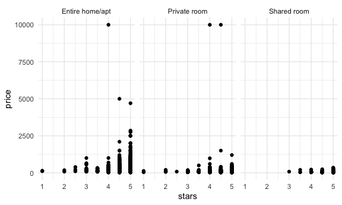

Case Study
================

Today we’re studying a case.

## Get Data

``` r
library(p8105.datasets)

data(nyc_airbnb)

nyc_airbnb = 
  nyc_airbnb %>% 
  rename(borough = neighbourhood_group) %>% 
  mutate(stars = review_scores_location/2)
```

## Brainstorm questions

-   what variables are relevant to higher review / scores?
-   what are the popular places to rent an airbnb?
-   what portion of hosts/ locations are private rooms vs entire
    apartments?
-   what makes an airbnb more expensive?

``` r
head(nyc_airbnb)
```

    ## # A tibble: 6 × 18
    ##       id revie…¹ name  host_id host_…² borough neigh…³   lat  long room_…⁴ price
    ##    <dbl>   <dbl> <chr>   <dbl> <chr>   <chr>   <chr>   <dbl> <dbl> <chr>   <dbl>
    ## 1 7.95e6      10 City…  1.19e5 Linda … Bronx   City I… -73.8  40.9 Privat…    99
    ## 2 1.60e7      NA WATE…  9.12e6 Collins Bronx   City I… -73.8  40.9 Privat…   200
    ## 3 1.89e6      NA Quai…  9.82e6 Steve   Bronx   City I… -73.8  40.8 Entire…   300
    ## 4 6.63e6      10 Larg…  1.39e7 Arlene  Bronx   City I… -73.8  40.8 Entire…   125
    ## 5 5.56e6      10 Quai…  2.88e7 Phoebe  Bronx   City I… -73.8  40.9 Privat…    69
    ## 6 9.15e6      10 Cozy…  4.03e5 Diane   Bronx   City I… -73.8  40.8 Entire…   125
    ## # … with 7 more variables: minimum_nights <dbl>, number_of_reviews <dbl>,
    ## #   last_review <date>, reviews_per_month <dbl>,
    ## #   calculated_host_listings_count <dbl>, availability_365 <dbl>, stars <dbl>,
    ## #   and abbreviated variable names ¹​review_scores_location, ²​host_name,
    ## #   ³​neighbourhood, ⁴​room_type

``` r
nyc_airbnb %>% 
  count(room_type)
```

    ## # A tibble: 3 × 2
    ##   room_type           n
    ##   <chr>           <int>
    ## 1 Entire home/apt 19937
    ## 2 Private room    19626
    ## 3 Shared room      1190

``` r
count(distinct(nyc_airbnb,id))
```

    ## # A tibble: 1 × 1
    ##       n
    ##   <int>
    ## 1 40753

``` r
most_popular = 
  nyc_airbnb %>%
  group_by(neighbourhood, borough) %>%
  distinct () #%>%
  #summarize(n_obs = n()) %>%
  #ungroup() %>% 
  #mutate(rank = min_rank(desc(n_obs)))
  #filter (rank < 5) %>% 
  #arrange(neighbourhood_group,n_obs)

most_popular
```

    ## # A tibble: 40,753 × 18
    ## # Groups:   neighbourhood, borough [217]
    ##          id review_s…¹ name  host_id host_…² borough neigh…³   lat  long room_…⁴
    ##       <dbl>      <dbl> <chr>   <dbl> <chr>   <chr>   <chr>   <dbl> <dbl> <chr>  
    ##  1  7949480         10 City…  1.19e5 Linda … Bronx   City I… -73.8  40.9 Privat…
    ##  2 16042478         NA WATE…  9.12e6 Collins Bronx   City I… -73.8  40.9 Privat…
    ##  3  1886820         NA Quai…  9.82e6 Steve   Bronx   City I… -73.8  40.8 Entire…
    ##  4  6627449         10 Larg…  1.39e7 Arlene  Bronx   City I… -73.8  40.8 Entire…
    ##  5  5557381         10 Quai…  2.88e7 Phoebe  Bronx   City I… -73.8  40.9 Privat…
    ##  6  9147025         10 Cozy…  4.03e5 Diane   Bronx   City I… -73.8  40.8 Entire…
    ##  7 11675715         10 Cozy…  5.67e7 Josue   Bronx   City I… -73.8  40.9 Entire…
    ##  8   715270          9 2 Be…  3.68e6 Enrique Bronx   Allert… -73.9  40.9 Privat…
    ##  9 17876530         10 Spac…  1.13e7 Yahaira Bronx   Allert… -73.9  40.9 Entire…
    ## 10   182177          9 PRIV…  8.73e5 Christ… Bronx   Allert… -73.9  40.9 Entire…
    ## # … with 40,743 more rows, 8 more variables: price <dbl>, minimum_nights <dbl>,
    ## #   number_of_reviews <dbl>, last_review <date>, reviews_per_month <dbl>,
    ## #   calculated_host_listings_count <dbl>, availability_365 <dbl>, stars <dbl>,
    ## #   and abbreviated variable names ¹​review_scores_location, ²​host_name,
    ## #   ³​neighbourhood, ⁴​room_type

# Let’s look at price . .

``` r
nyc_airbnb %>% 
  group_by(borough, room_type) %>% 
  summarize(
    mean_price = mean(price, na.rm = TRUE)
  ) %>% 
  pivot_wider(
    names_from = room_type,
    values_from = mean_price
  )
```

    ## `summarise()` has grouped output by 'borough'. You can override using the
    ## `.groups` argument.

    ## # A tibble: 5 × 4
    ## # Groups:   borough [5]
    ##   borough       `Entire home/apt` `Private room` `Shared room`
    ##   <chr>                     <dbl>          <dbl>         <dbl>
    ## 1 Bronx                      125.           65.5          57.5
    ## 2 Brooklyn                   175.           76.7          59.6
    ## 3 Manhattan                  238.          107.           84.7
    ## 4 Queens                     140.           70.6          49.1
    ## 5 Staten Island              207.           65.4          25

Look at price distribution

``` r
#nyc_airbnb %>% 
#  filter(borough == "Manhattan", 
#         room_type == "Entire home/ apt",
#         price > 1000) %>% 
#  ggplot(aes(x=price)) +
#  geom_histogram() %>% 
#  facet_grid(. ~ room_type)
```

Price vs rating?

``` r
nyc_airbnb %>% 
  filter(borough == "Manhattan") %>% 
  ggplot(aes(x = stars, y=price))+
  geom_point() +
  facet_grid(. ~ room_type)
```



Somewhat fancy boxplot!

``` r
nyc_airbnb %>% 
  filter(borough == "Manhattan") %>% 
  group_by(neighbourhood) %>% 
  summarize(mean_price = mean(price, na.rm = TRUE )) %>% 
  arrange(desc(mean_price))
```

    ## # A tibble: 32 × 2
    ##    neighbourhood     mean_price
    ##    <chr>                  <dbl>
    ##  1 Tribeca                 353.
    ##  2 Flatiron District       319.
    ##  3 NoHo                    302.
    ##  4 Greenwich Village       258.
    ##  5 SoHo                    256.
    ##  6 Midtown                 251.
    ##  7 West Village            239.
    ##  8 Chelsea                 233.
    ##  9 Theater District        232.
    ## 10 Battery Park City       221.
    ## # … with 22 more rows

``` r
nyc_airbnb %>% 
  filter(borough == "Manhattan",
         room_type == "Entire home/apt",
         price <= 1000) %>% 
  mutate(neighbourhood = fct_reorder(neighbourhood, price)) %>% 
  ggplot(aes(x=neighbourhood, y=price)) +
  geom_boxplot() +
  coord_flip()
```


Price vs location

``` r
nyc_airbnb %>% 
  filter(borough == "Manhattan",
         room_type == "Entire home/apt",
        price <= 1000) %>% 
  sample_n(2000) %>% 
  mutate(neighbourhood = fct_reorder(neighbourhood, price)) %>% 
  ggplot(aes(x=lat, y=long, color=price)) +
  geom_point(alpha=0.5)
```


